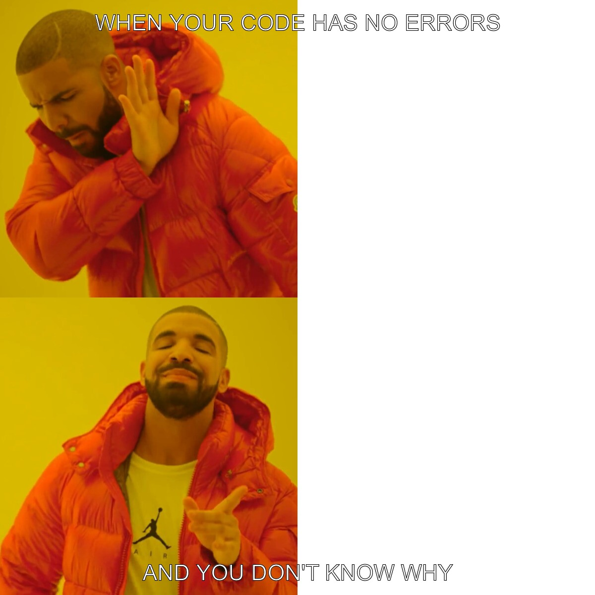

# STATS220 Project 1

## Description
This project creates a meme using R and the magick package.

## Tools used
- R
- RStudio
- tidyverse
- magick

## What the code does
- Reads an image from a URL
- Adds text to the top and bottom
- Saves the meme as a PNG file

## Meme preview

